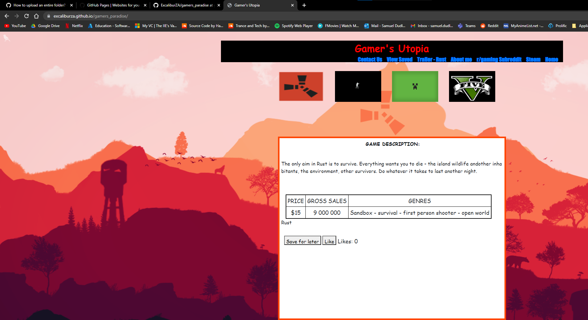

# Gamer's Utopia
This is an interactable gaming website where users can learn more about their favourite games and get in touch with the company providing it.

## Table of Contents
*Name and descrption - Page 1*

*Installation guide - Page 2*

*Appliction usage guide - Page 3*

*Credits - Page 4*

## Installation guide
To install the application simply download the files or clone the repository from Github (if access has been allowed). Once the files have been downloaded simply
run index.html from the application folder to launch the program. Note that index.html is the only .html file not included in the Pages folder.

## Application usage guide
Users can select games by clicking on the icons with their respective logos. When selected users can view information about the game,
save it to a list to come back to later, or leave a like on it if they enjoyed the post. 

Users can also view a YouTube video of the Rust trailer, although this functionality will eventually be expanded to include other games as well.

The other appropriately labelled navigation bar items can be used to traverse the rest of the website including the author's information page and a contact page.

## Credits
Author: Samuel Dudley - https://github.com/ExcaliburZA
Samuel Dudley is the soul author and publisher of this software and is solely responsible for its maintenance and support.
